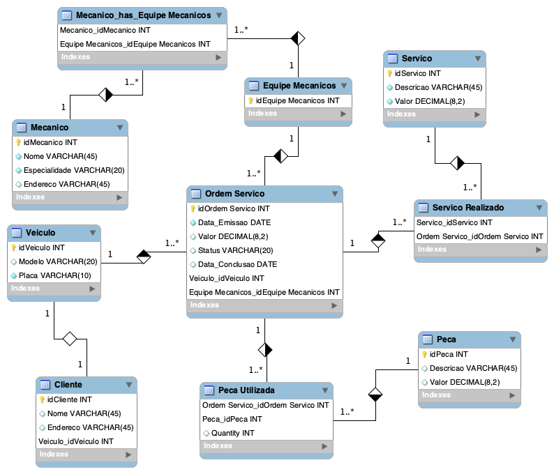

# Desafio 2 - Modelagem Conceitual de Banco de Dados - Oficina Mecânica

Este repositório contém a solução do Desafio 2 da Formação SQL Specialist da DIO, onde foi proposta a modelagem conceitual de banco de dados para um sistema de controle e gerenciamento de ordens de serviço em uma oficina mecânica.

### Objetivo

O objetivo deste desafio é criar o esquema conceitual do banco de dados para o contexto da oficina mecânica, considerando as seguintes funcionalidades:

- Clientes: Os clientes levam seus veículos à oficina mecânica para serviços de conserto ou revisões periódicas. Cada veículo é designado a uma equipe de mecânicos, que identifica os serviços a serem executados e preenche uma Ordem de Serviço (OS) com a data de entrega.

- Mão-de-Obra: A partir da OS, é calculado o valor de cada serviço, consultando uma tabela de referência de mão-de-obra. O valor de cada peça também é incluído na OS.

- Autorização do Cliente: O cliente autoriza a execução dos serviços descritos na OS.

- Equipe de Mecânicos: Os mecânicos possuem código, nome, endereço e especialidade. A mesma equipe avalia e executa os serviços.

- Ordem de Serviço (OS): Cada OS possui um número, data de emissão, valor total, status e uma data para conclusão dos trabalhos.

### Tecnologias Utilizadas

- Ferramentas: MySQL Workbench

### Resultado

